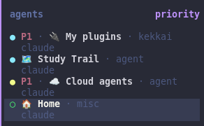

# herdr-priority-view

A [herdr](https://herdr.dev) plugin that reorders the agent panel by how much
attention each agent needs, and lets you mark individual agents as high or low
priority.



herdr's built-in `agent_panel_sort = "priority"` puts the agent that changed state
most recently at the top. When several agents finish close together, the one that
finished first moves down the list and you stop noticing it. This plugin orders
the panel instead:

1. by status: blocked, then done, then working, then idle, then unknown
2. within a status, higher priority first
3. within a priority, the agent that has been waiting the longest first

A blocked agent always comes first, and an agent whose result you have not seen
comes before one you already looked at.

## Priorities

Every agent starts at normal priority and its row looks exactly as it did before.
Mark the focused agent high or low with a keybinding, and the mark shows up next
to the state dot as `P1` or `P3`.

The plugin keys priorities by agent session, so they follow the conversation when
you move its pane and survive a herdr restart. A priority ends with its
conversation. When the agent exits the plugin removes the mark, so resuming that
conversation later starts it at normal.

## Requirements

- herdr >= 0.9.0
- [bun](https://bun.sh)

There is no build step, so the scripts run straight from source and `bun` has to
be on the PATH of the herdr *server*, not just your shell. If bun comes from a
version manager, that usually means starting herdr from a shell where it resolves.

## Install

```bash
herdr plugin install asermax/herdr-priority-view
```

The ordering applies on the next herdr server start. The marks need a bit of
config, because a plugin cannot ship keybindings or sidebar rows.

## Setup

Add this to `~/.config/herdr/config.toml` and run `herdr server reload-config`:

```toml
[[keys.command]]
key = "prefix+1"
type = "plugin_action"
command = "asermax.priority-view.high"
description = "priority: high"

[[keys.command]]
key = "prefix+2"
type = "plugin_action"
command = "asermax.priority-view.normal"
description = "priority: normal"

[[keys.command]]
key = "prefix+3"
type = "plugin_action"
command = "asermax.priority-view.low"
description = "priority: low"

[ui.sidebar.agents]
rows = [
  ["state_icon", { token = "$priority", rules = [
    { equals = "P1", fg = "#f38ba8", bold = true },
    { equals = "P3", dim = true },
  ] }, "machine", "workspace", "tab"],
  ["agent"],
]
```

The `$priority` token renders the mark. Without it in a row the plugin still
sorts, it just shows nothing. Pick your own keys if these collide. herdr reports
a conflict as a `partial` status on reload.

## How it works

herdr keeps one active agent view, set through `agent.view.set`. Its `status` sort
orders the five states in one fixed way, so it cannot rank statuses and then break
ties by priority. The plugin writes a `rank` metadata token on each agent pane
instead, holding the status rank and the priority digit. The view sorts by that
token and then by herdr's state-change sequence.

Event hooks on `pane.agent_detected` and `pane.agent_status_changed` recompute the
token. There is no long-running process.

When an agent exits, herdr fires `pane.agent_detected` with `released: true`, but
by then it has already cleared the pane's agent and its session id. Pane metadata
persists after the agent is cleared, so the plugin keeps the session id in a
`session` token on the pane, and the release hook reads it back to drop the right
entry. Closing a pane outright fires no release event, so the plugin deletes
entries whose conversation is no longer live the next time you press a priority
key.

## Uninstall

```bash
herdr plugin uninstall asermax.priority-view
```

The agent view stays registered after you uninstall the plugin, until the server
restarts. To drop it without restarting, clear it over the socket:

```bash
printf '{"id":"1","method":"agent.view.clear","params":{"source":"asermax.priority-view"}}\n' \
  | socat - UNIX-CONNECT:$HOME/.config/herdr/herdr.sock
```
